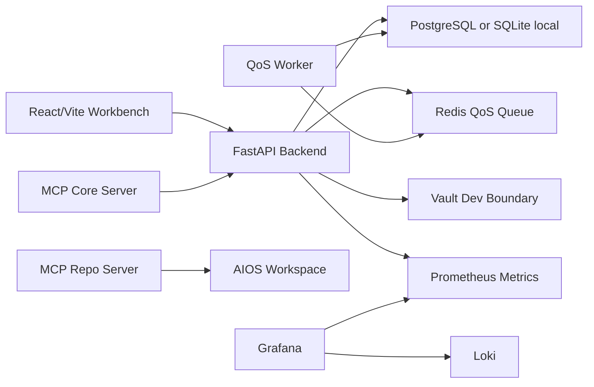

# Architecture

## Contract

The frontend talks only to the backend API. Codex runtime integration stays behind `backend/app/codex_adapter.py`, so the local demo adapter can be replaced without rewriting product surfaces.

## Product invariant

Entitlement and UI must preserve `productUnit = codex_sessions`. Token counters, token balances, and weekly token quotas are intentionally absent from the product experience.
